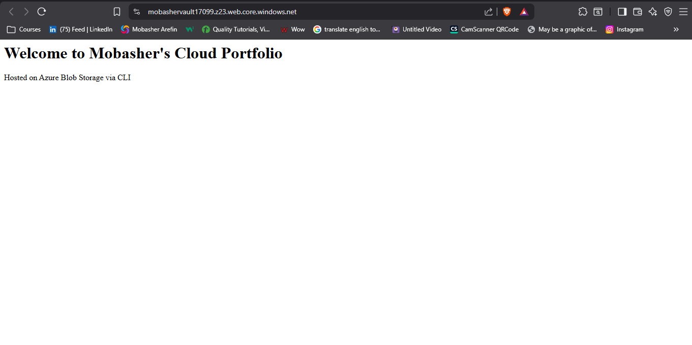
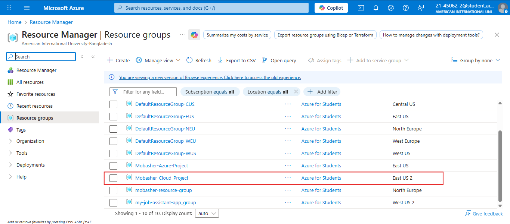
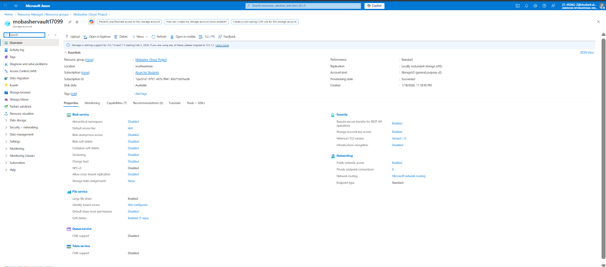

# 🌐 Azure Serverless Static Web Hosting 
### Infrastructure as Code (CLI) & Global Content Delivery

This project demonstrates the deployment of a high-performance, serverless static website using **Azure Blob Storage**. I successfully bypassed local subscription policy restrictions by auditing and pivoting infrastructure to a permitted global region using **Azure CLI**.

---

## 🚀 Live Demo & Visual Proof
* **Live Website URL:** [https://mobashervault17099.z23.web.core.windows.net/](https://mobashervault17099.z23.web.core.windows.net/)
* **Project Status:** `Succeeded` ✅

### 🖥️ Live Site Preview

*(Description: My static portfolio index page rendered via Azure Blob Storage endpoint.)*

---

## 🛠️ Infrastructure Architecture


### 1. Resource Group & Global Region Auditing
I initially faced `RequestDisallowedByAzure` errors in US/Europe regions due to subscription policies. I troubleshot this by querying available regions via CLI and successfully provisioned resources in **Southeast Asia (Singapore)**.

**Resource Group Proof:**

*(Description: Azure CLI output showing the successful creation of the 'Mobasher-Cloud-Project' resource group.)*

### 2. Storage Account Provisioning
I provisioned a **StorageV2 (General Purpose v2)** account with **LRS (Locally Redundant Storage)** to ensure cost-efficient data availability.

**Storage Provisioning Proof:**

*(Description: JSON output from terminal confirming "provisioningState": "Succeeded".)*

---

## ⌨️ Deployment Commands used
```bash
# Create the Resource Group in an authorized region
az group create --name Mobasher-Cloud-Project --location southeastasia

# Provision the Unique Storage Account
az storage account create \
    --name mobashervault17099 \
    --resource-group Mobasher-Cloud-Project \
    --location southeastasia \
    --sku Standard_LRS \
    --kind StorageV2

# Enable Static Website Hosting feature
az storage blob service-properties update \
    --account-name mobashervault17099 \
    --static-website \
    --index-document index.html

# Upload the index.html file to the $web container
az storage blob upload \
    --account-name mobashervault17099 \
    --container-name '$web' \
    --name index.html \
    --file index.html \
    --auth-mode key